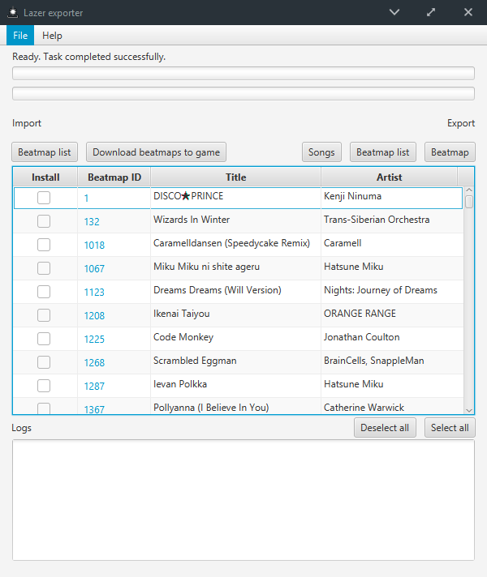

# Lazer exporter

A utility for importing and exporting beatmap list, as well as extracting songs and beatmaps installed in osu!Lazer

## Disclaimer

The author of this application is not affiliated with ppy Pty Ltd.

"osu!" and "ppy" are trademarks of ppy Pty Ltd.

### Login requirement

The download beatmap feature requires logging in using your account. Please note that the application does not store any of your credentials and they will only be sent to [osu.ppy.sh](https://osu.ppy.sh).

If you are not comfortable of using your account on a third-party application, the application provides official links to the beatmap sets as an alternative.

### Exporting songs

The copied and/or modified songs by this program are stored in the user's (The individual operating this program) device only. These songs are intended for personal use only and should not be distributed without permission from their respective copyright owners. As such, in no event shall the author be liable for any copyright infringement claims. The user will have to bear all legal responsibility when distributing copyrighted properties.

In short,

Do not use this program for distributing songs illegally. The creator of this program is not responsible for such actions.

## Features
* Import and export beatmap list
* Download beatmaps directly from osu server after importing a list (Requires osu account login)
* Export installed beatmaps back to .osz format
* Multiple language support (Translators needed! I'll make a Google spreadsheet when I have the time)
* Export songs that are installed in the game
    * Proper file renaming (Romanji/Unicode/Rename after the beatmap ID)
    * Adding MP3 tags based on beatmap info
    * Filter practice beatmaps
    * Filter duplicates based on song length
    * Conversion from .ogg to .mp3 (Done through FFmpeg)
    
## Things to note

The album art provided in beatmaps are (mostly) in 16:9 ratio. As a result, most music players may not be able to display them except a few exceptions (E.g. VLC in desktop). If you don't use the apply tags feature when exporting songs, this will not affect you.

The FFmpeg used for exporting songs supports both 32 bit and 64 bit with the following requirements.

* Windows 7 and above
* macOS 10.6 and above
* Any Linux distributions
  * The binary used is 32 bit. Please make sure you have the required libraries to enable 32 bit compatibility
  * You will need to install OpenJFX to run this program

## Building

The artifact can be built through standard IntelliJ tools. Additional libraries that are not in maven are stored in /lib. Please check the [README.md in /lib](https://github.com/ringosham/Lazer-exporter/tree/master/lib) for more information.

## Downloads

Go to the [release](https://github.com/ringosham/Lazer-exporter/releases) tab

## License

All code in this program, with the exception of dependencies, are under Apache License 2.0

All assets used, except the GitHub Mark logo, are under CC-BY-NC 4.0

## Dependencies

[JAVE](https://sauronsoftware.it/index.php) - Java FFmpeg wrapper - Under GNU GPL v3 license

[FFmpeg project](https://ffmpeg.org) - Cross-platform audio and video transcoder - Under GNU GPL v3 license

[mp3agic](https://github.com/mpatric/mp3agic) - Java library for reading/manipulating ID3 tags - Under MIT license

[SQLite JDBC](https://xerial.org/) - SQLite JDBC library - Under Apache 2.0 license